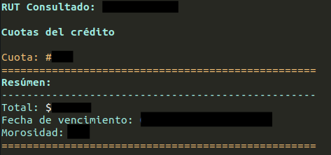
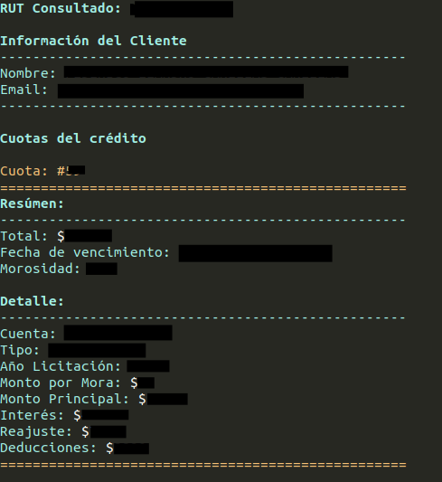

### CLI CAE Scotiabank

Herramienta para automatizar la consulta de cuotas del crédito CAE, para los deudores licitados por Scotiabank desde una terminal (bash por ejemplo).

---

#### Versión de Python

- Python3.8

---

### Dependencias

**Linux Debian (Ubuntu, Mate, Debian...)**

- `sudo apt-get install python3-pip`

**Módulos Python necesarios**

- `pip3.8 install requets`

---

**Opciones del programa**
```
usage: cae-query [-v] [-h] [-o HIDE] [-r DNI]

CAE Query - Obtiene los detalles de la cuota/s CAE - Scotiabank

optional arguments:
  -v       Muestra la versión del script.
  -h       Muestra éste mensaje de ayuda para el usuario.
  -o HIDE  Permite ocultar partes de la salida. (Por defecto se muestra todo) cd: Oculta el detalle
           de la/s cuotas. dd: Oculta la información del deudor.Ejemplo: -o QDCD
  -r DNI   Recibe el RUT del cliente a consultar.
```

### Alias de uso rápido (Linux)

Es posible crear un comando `cae` a partir de un alias de la siguiente forma:

`alias cae="DIRECTORIO/cae-query -o ddcd -r XX.XXX.XXX-X"`

---

**Forma de uso**

- Formato extendido: `cae-query -r "XX.XXX.XXX-X"`
- Formato reducido `cae-query -o ddcd -r "XX.XXX.XXX-X"`

---

### Capturas

**Formato reducido**



**Formato extendido**



---

### Corrección de errores y mejoras

Actualmente, el programa hace lo que debe, no tengo contempladas mejoras, sólo correcciones de errores según aparezcan.
